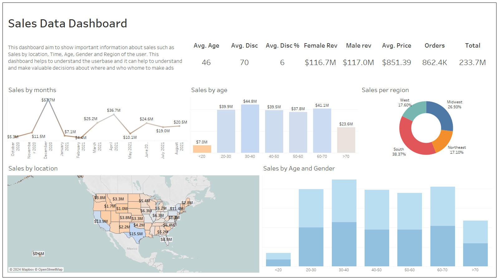

# SalesDashboard

---

This Tableau dashboard offers a 360-degree view of retail sales data, highlighting key metrics such as average age, discounts, and revenue by gender. It features interactive elements like bar graphs for monthly sales, a map for sales by location, and a pie chart for regional distribution. The dashboard is designed to facilitate informed decision-making by providing a clear understanding of sales trends across various demographics and regions. With its intuitive layout, it serves as an essential tool for analyzing and optimizing retail performance. 📊🛒

### Dashboard information

 - In this dashboard presents information about sales data.
 - It includes a Line graph which shows the sales performance on monthly chart.
 - It includes a bar graph which shows the sales divided into different Age groups.
 - Sales represented on a donut chart which is divided into regions of US.
 - It includes a map of USA with sales figures and different color grading for high or low sales.
 - It includes a stacked bar graph which shows different age groups and gender for total sales.
 - All these graphs can be filtered using any graph, all the data will be filtered using any graph.
 - A total summar is also presented on the top of the dashboard.
 - Database location [here](https://github.com/stanley-george-joseph/Customer-Analysis-Tableau/blob/main/sales_06_FY2020-21.csv.zip)
